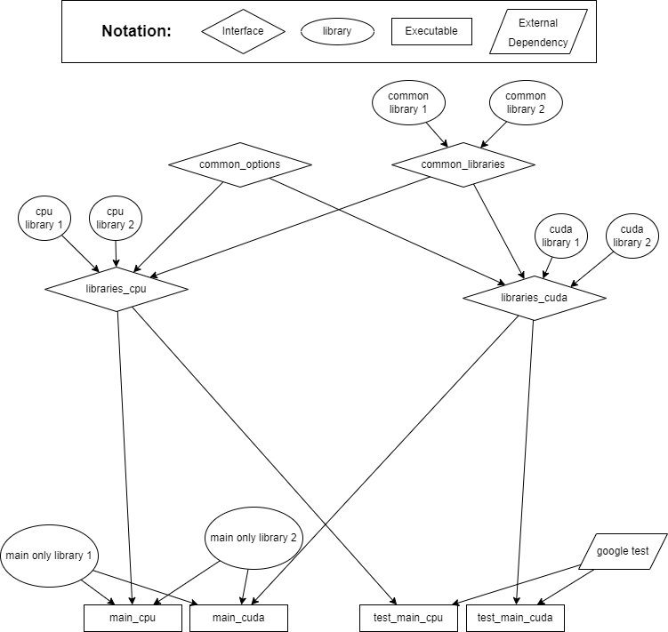

Getting Started
===============

Setup
+++++

For setting up, it is recommended to first read the :ref:`Tools` page then come back to this page.

Typical workflow
++++++++++++++++

This section will describe a typical workflow from writing a new piece of code, to checking it against formats and testing it, to seeing code coverage and documentation for it. To understand what each script does, it is recommended to open them up in a text editor and seeing what they do.

#. Write a new header file template
#. Write a new cpp file for it
#. Write a test for it to test that the new functions work
#. Run `./scripts/build/build_tests.sh` to build the testing executable
#. If clang-tidy or clang-format say that there is some misformatted code or if there are errors in the build, then fix them and run again.

   #. At this point you may want to consider running `./scripts/standalone/apply_clang_format.py` if you agree with the changes proposed by clang-format

#. Run `./scripts/standalone/run_tests.sh` to run the tests and generate the code coverage report which can be found by opening *docs/index.html* in a browser and choose the *Code Coverage* option
#. Integrate the new functions into the program and test again
#. Once you have a main executable ready to be run you can run `./scripts/build/build_all.sh` to generate a debug build of your code.
#. You can run your code by running `./build/src/main`, which is the main executable generated
#. Here you may update the documentation. You can run `./scripts/build/build_docs.sh`, which will generate the documentation in the docs folder. Similarly with the code coverage, you may open *docs/index.html* in a browser and this time choose the *Documentation* option.
#. After you are satisfied and wish to generate a release executable, you may run `./scripts/build/build_release.sh` and then you may execute it by running `./build/src/main`.

Working with CMake
++++++++++++++++++

This section will describe the cmake configuration of this project and how it all comes together to build the executable. Furthermore I will advise how one needs to add new libraries easily.

.. _label: CMakeHierarchy

  Hierarchy of CMake Outputs

In Figure :numref:`CMakeHierarchy`, you may see the hierarchy of how each file affects the other. A->B means that A affects B, such that whatever options or whatever we link to A will also be in B. Of course, we try to be as modular as possible as well, so we should not just put every source file into one library and call it a day.

Our strategy is to combine modules into libraries, shown with ellipses. Then we combine these libraries with interface libraries. The executables then use these interface libraries to link everything together. Now we go through what each of the above represent.

* `BuildCommon.cmake`

  * `common_options`: An interface library containing options which will be used by everyone, such as the any additional compiler flags or the debug/release mode.
  * `common_libraries`: Interface library which combines modules/implementation files that are used by both the cpu and gpu versions of the appliction. These are usually cpu implementations with no CUDA equivalent
  * `libraries_cpu`: Similar to `common_libraries` but combines only cpu files.
  * `libraries_cuda`: Similar to `common_libraries` but combines only CUDA files.

* `BuildMain.cmake`:

  * `main_cpu`: A target which builds the cpu version of the main executable
  * `main_cuda`: A target which builds the cuda version of the main executable

* `BuildTests.cmake`:

  * `test_cpu`: A target which builds the cpu version of the test executable
  * `test_cuda`: A target which builds the cuda version of the test executable

This means that when adding a new module, we will follow the following steps:

#. Create the module and write some code for it
#. Go to `BuildCommon.cmake` and create a library for it. In this file you will find a *TODO* with the message *Add more libraries here*
#. Link the library with either `common_libraries`, `libraries_cpu` or `libraries_cuda`, depending on the library itself.
#. If you also have a test file, add the test source file to the `test_common_sources` found in `BuildTests.cmake`. You will find a *TODO* in this file with the message *add more source files here*.

There may be some special cases apart from the ones mentioned above, in which case you will need to do some research how to get started, however this should cover the most general use case.
